# The Isekai power graph

What changes a character's Power, what changes the village's earnings, and where two systems
multiply each other. Measured 2026-09-18 against the full config set
(`.../apk-audit/configs/config/logic`, 1,499 tables) and the decompiled client
(`.../private-server/readable/*.lua`).

Every claim is tagged **MEASURED** (table + field, or lua file + line) or **INFERRED**.
Positive control for the sweeps below (rule 2): `ls | grep -cE '^Wife|^City|^SimGame3'` returns
40 / 19 / 21 on the full set; `SkillBase.json` parses to 6,780 rows under key `SkillBase`;
`SkillLevel.json` to 64,813 under key `SkillLevel`. Shapes checked before counting (rule 3), one
real row read before assuming any field (rule 4), and every number parsed with `float()` because
three shapes arrive (rule 5).

---

## 1. The one formula everything funnels into

MEASURED — `PropManager.lua:100-120`, `local function Formula_ADD`:

```lua
local base         = calc_formual_part(inst.base, ...)          -- sum of named "base" parts
local percent      = calc_formual_part(inst.percent, ...)
local extrapercent = calc_formual_part(inst.extrapercent, ...)
local extradd      = calc_formual_part(inst.extradd, ...)
local coef         = (inst.coef or replace.coef) and calc_formual_part(inst.coef, ...) or 1
local coefpercent  = calc_formual_part(inst.coefpercent, ...)
local totalpercent = calc_formual_part(inst.totalpercent, ...)
local fightBase = base * (1 + percent/10000) * (1 + extrapercent/10000) * coef * (1 + coefpercent/10000) + extradd
local fight     = fightBase * (1 + totalpercent/10000)
return math.floor(fight)
```

So, with all percents in units of 1/10,000:

```
Power = ( base × (1+percent) × (1+extrapercent) × coef × (1+coefpercent) + extradd ) × (1+totalpercent)
```

Six buckets. **Every** system in the game writes into one of them, and each bucket is a plain sum
of *named parts* (`calc_formual_part` sums `part.count` over the parts dict,
`PropManager.lua:76-98`). Two buckets are multipliers of each other's product — `coef` and
`percent` — which is exactly where a recreation that treats a contribution as additive lands two
to four orders of magnitude low.

The same function computes hero Power, hero HP/ATK/DEF, and **building yield**:

| accessor | call | file:line |
|---|---|---|
| hero displayed Power | `CalcProp("underling", heroId, "totalPower")` | `PropManager.lua:404` |
| hero ATK | `CalcProp("underling", heroId, "atk")` | `PropManager.lua:396` |
| building yield | `CalcProp("building", buildingId, "yield")` | `PropManager.lua:543` |

MEASURED. The bucket names in config are slightly different from the client's: `SkillBase.json`
`skillProp.propType` takes only four values — `percent` (2,781 rows), `finalpercent` (495),
`extradd` (467), `base` (15). `finalpercent` is the client's `totalpercent`
(INFERRED from `SkillManager.lua:155`, which formats `percent` and `finalpercent` identically and
knows no other multiplier tail). `coef` / `coefpercent` are never named in `SkillBase`; they are
reached through `skillProp.id == "talent"` instead — see §2.

## 2. `coef` is the Talent multiplier, and Talent is a *sum of systems*

MEASURED — `UnderlingData.lua:56-70`:

```lua
DEF_PROP(UnderlingData, "AllTalentsExtAdd",  function (cur) return cur:CalcProp(ATK, FORMULA_COEF) end)
DEF_PROP(UnderlingData, "AllTalentsPercent", function (cur) return cur:CalcProp(ATK, FORMULA_COEF_PERCENT) end)
DEF_PROP(UnderlingData, "AllTalents",        function (cur) return cur.AllTalentsExtAdd * (1 + cur.AllTalentsPercent / 10000) end)
```

and `UnderlingData.lua:430-436`:

```lua
DEF_PROP(UnderlingData, "FightBase", function (cur)
	local base = cur:CalcProp(PropManager.ATK, PropManager.FORMULA_BASE)
	local extrapercent = cur.AllTalents
	extrapercent = math.max(extrapercent, 1)
	return math.floor(base * extrapercent)
end)
```

**Talent is not an additive stat. It is the coefficient the whole base is multiplied by**, floored
at 1. A skill whose `skillProp.id` is `"talent"` carries no `propType` at all (2,933 of 6,722
`skillProp` objects have only `id`) — because it does not need one: `talent` *is* the bucket.

The named parts of `coef`, each read individually by the client (`UnderlingData.lua:72-266`):

| part name | what it is | reachable value | evidence |
|---|---|---|---|
| `herobasetalent` | the hero's own base talent skill | `Hero.json.initialTalent` 20–120 + `Hero_Talent_Base_N` at lv 300 = **300** | MEASURED `SkillBase` `Hero_Talent_Base_1`: Initial 1, Level 1, maxUpgradeLevel 300 |
| (quality) | breakthrough rank | **0 → 65** | MEASURED `HeroQuality.json`, 14 rows, `Talent`; also `HeroDetailsTalentNew.lua:847` `cur = initialTalent + qualityConf.Talent` |
| `heroequipmenttalent` | equipped artifact | `initialTalent + riseTalent × coefficientADH(level)`; best = 70 + 8×199 = **1,662** | MEASURED `EquipmentManager.lua:215`; `Equipment.json` `LegendaryWeapon_1_1` (70/8), `levelMax` 200 for all 99 rows; `EquipmentLevel.json` coefADH(200)=199 |
| `heroskilltalent` | every other talent-granting skill | see §3 | MEASURED `UnderlingData.lua:119-126` |
| `wifeskilltalent` | Wife (Family) blessings/skills | `Wife_BlessSkill1_112` 1+1×999 = **1,000** each, 34 rows | MEASURED |
| `pettalentadd` | the bound pet | **2–250 per external slot** | MEASURED `PetInfo.lua:850`; `PetExternalSkill.json` pool `type "2"` min 2 max 250 |
| `underlingskilltalentpercent`, `pettalentpercentadd` | write `coefpercent`, not `coef` | pet: `type "4"` 951–1000 (+9.5%…+10%) | MEASURED `PetInfo.lua:851`, `UnderlingData.lua:246-266` |

`AllSkillTalents` (`UnderlingData.lua:119`) subtracts the side-game contributions back out of
`heroskilltalent` purely so the UI can itemise them — proof that all of these land in the same
`coef` sum:

```lua
count = count - cur.FishToTalent - cur.MedicineToTalent - cur.SimGame3ToTalent - cur.TDToTalent
              - cur.SpiritTalent - cur.MuseumToTalent - cur.CharacterGroupTalent - cur.BuildingAppearanceTalent
```

## 3. `base` barely moves — this is the counter-intuitive part

MEASURED — `HeroLevel.json`, 1,000 rows, field `coefficientADH`, and `Hero.json`
`initialATK: 0, riseATK: 1` for every hero. By analogy with the equipment line
(`EquipmentManager.lua:239` `initialATK + riseATK * equLevelConf.coefficientADH`), hero base ATK is
`initialATK + riseATK × coefficientADH(level)` — INFERRED, because the hero's `base` part is
server-pushed (`PropManager:updateSingleProps`, `:211`) and the client never recomputes it.

| level | 1 | 100 | 300 | 312 | 500 | **750 (cap)** | 1000 (table end) |
|---|---|---|---|---|---|---|---|
| coefficientADH | 300 | 925 | 3,362 | 3,566 | 7,590 | **15,500** | 26,390 |
| level-up cost (gold) | 100 | 3,000 | 100,000 | 114,400 | 2e6 | 1e8 | 4.5e10 |

Level 1 → level 750 is **51.7x**. The level cap itself comes from `HeroQuality.levelLimit`
(100 at quality 1 → **750** at quality 14), so levels 751–1000 in `HeroLevel.json` are unreachable
content — the table is wider than the game.

**So levelling is not where power comes from.** 51.7x from the entire level track, against a
`coef` that reaches 219,033 and a `percent` that reaches +76,426% for one real hero (§5).
Any recreation that puts its growth in the level curve will be flat and short.

## 4. Who buffs whom: the halo/broadcast layer

MEASURED — `SkillBase.json` `targetCondition.conditionType`, 6,780 rows:

| conditionType | rows | meaning |
|---|---|---|
| `country` | 1,852 | applies to every owned hero of that country (5 countries, `Country.json`) |
| `rare` | 1,755 | applies to every owned hero of that rarity |
| `self` | 1,550 | only the hero that owns the skill |
| `all` | 555 | every owned hero |
| `bless` | 341 | gated on a Wife blessing |
| `bond` | 323 | a bond group (`HeroBond.json`, 23 bonds × 5 heroes) |
| `equipment` / `skill` / `heroId` / `sex` / `pledge` / `building` / `id` / `group` | 116 / 76 / 46 / 20 / 15 / 20 / 5 / 4 | narrower gates |
| (one row carries a *list* of conditions) | 1 | `HeroClothes_Halo_Bond1_3`, 5 `id` entries |

`PropManager:GetHeroAtkSkillAddBySystemName` (`:551-571`) shows the resolution order explicitly:
a hero's percent add is `hero_to_all + wife_to_all + hero_to_self + wife_to_self +
hero_to_country + wife_to_country`, all summed into one `percentAdd`. MEASURED.

**This is the structural reason the original's numbers are so large.** Only 1,550 of 6,780 skills
are self-only. The rest are broadcast: recruiting and levelling *one* hero raises every other hero
of its country and rarity. Power is roughly quadratic in roster completion, not linear.

## 5. What one real hero can reach

Worked for **hero 113** (`Hero.json`: `country 3`, `rarity 5`, `initialTalent 120`). Every
`SkillBase` row with `skillProp.id` in {`atk`, `talent`} was evaluated at its own cap —
`Initial + Level×(maxUpgradeLevel-1)`, or `SkillLevel.skillProp_Level_Uneven_Growth` at the top
level when `skillProp_Growth_Type == 2` (`SkillManager.lua:45-80`) — then attributed by
`targetCondition`. Self-only rows counted only if hero 113 declares them (its own 20 skills, from
`heroBaseSkill`/`heroStarHaloSkill`/`bondSkill`/`operationSkill`/`heroSpiritTalentSkill`).

| bucket | total | biggest contributors |
|---|---|---|
| `coef` (Talent) | **219,033** | rarity-5 broadcast 90,623 · country-3 broadcast 42,276 · bless 38,330 · bond 16,693 · pledge 15,000 · own 6,000 · all 5,241 · equipment 4,870 |
| `percent` | **7,642,625** (= ×765.3) | bless 2,795,700 · bond 2,332,150 · all 1,274,795 · country-3 613,600 · rarity-5 314,380 |
| `finalpercent` (`totalpercent`) | **341,500** (= ×35.2) | country-3 206,500 · all 135,000 |
| `extradd` | **901,089,500** | rarity-5 625,875,000 · **own `Hero113_Power_1` 149,000,000** · country-3 70,126,000 · all 56,088,500 |

332 rows were **excluded** as sentinels, not caps: `maxUpgradeLevel = 99,999,999` on every
`Fish_*` / `Fish_G_*` / `Artifact_*` / `SG*_*` row. That value is "no cap" — the real ceiling is
how many of that fish/artifact you own — so summing them yields meaningless 1e11-scale figures.
Flagged here because doing it accidentally is exactly the mistake rule 6 warns about.

The absolute ceiling is therefore of order
`15,500 × 765 × 219,033 + 9e8 ≈ 2.6e12`, then `×36.2` → **~9e13**. The owner's ~300,000,000 after
a few weeks is ~3e-6 of that. **300M is not near the original's ceiling; it is early-game.**

### The single biggest per-hero term: `Hero###_Power_#`

MEASURED. 132 rows, `skillType` matching `^Hero\d+_Power_\d+`, every one
`targetCondition: {conditionType: "self"}`, `skillProp: {id:"atk", propType:"extradd"}`,
`skillProp_Growth_Type: 2`. Levels live in `SkillLevel.json`. `Hero113_Power_1`, 20 levels:

```
3,000,000 · 6,000,000 · 9,000,000 · 14,000,000 · 19,000,000 · … · 129,000,000 · 139,000,000 · 149,000,000
```

Family total across the roster: **13,740,750,000** (+1,055,000,000 for the 10 `_TWJP` variants,
+121,200,000 for the 4 `Hero###_SelfPowerAdd_#`). The levels are granted by **`HeroSpirit.json`**
— MEASURED: `grep -o '"Hero113_[A-Za-z_0-9]*"'` returns 40 hits in `HeroSpirit.json` for
`Hero113_Power_1`, 20 in `SkillLevel.json`, 2 in `SkillBase.json`, and nothing anywhere else. The
same table drives `Hero113_NewHalo_1..4` (talent, up to 340) and `Hero113_NewHalo_3`
(atk percent, up to **47,500 = +475%**). The rank→level mapping is being measured separately
(`docs/…stella…`); treat the skill values above as the settled half.

This one system is worth up to **149,000,000 flat Power on one hero**, before the `×(1+totalpercent)`
tail. At the owner's reported ~300,000,000 best hero, `Hero###_Power_#` alone plausibly accounts
for a third to a half of it.

## 6. Account-wide layer inventory

Each of these is a *separate* system with its own currency and its own table, and each one writes
into `coef` or `percent` for **every** owned hero (scoped by `all` / `country` / `rare`). "Per-char"
means the level is stored per hero.

| system | tables | writes | scope | reachable value | evidence |
|---|---|---|---|---|---|
| Hero level | `HeroLevel` (1,000 rows) | `base` | per-char | ×51.7 (300→15,500) | MEASURED |
| Breakthrough / quality | `HeroQuality` (14) | `coef` +0…65; **level cap 100→750** | per-char | ×7.5 level cap | MEASURED |
| Talent pearls | `HeroTalentLevel` (130), `Hero_Talent_Base_N` (482 rows) | `coef` +300 each | per-char | 370,800 game-wide | MEASURED |
| Stars / star halo | `HeroStar` (7 rows: `riseADH`→6,000, `extraAtk`→7,500,000, `starHaloSkillLevel` 1→7) + `Hero_Star_Halo_Nomal` (835 atk rows: 390 `percent`, 444 `finalpercent`, 1 `extradd`) | `percent`, `totalpercent`, `extradd` | per-char, broadcast halos | `finalpercent` 1,125,000 game-wide; per-hero +35% typical | MEASURED |
| **Spirit** | `HeroSpirit` (3,266 rows / 126 heroes), `WifeSpirit` (2,109 / 89) | `extradd` (`Hero#_Power_#` → 149M), `coef` (`NewHalo` → 340), `percent` (`NewHalo` → 47,500) | per-char, some broadcast | **13.7e9 extradd game-wide** | MEASURED |
| Artifacts / equipment | `Equipment` (99), `EquipmentLevel` (1,000, cap 200), `EquipmentQuality` (202), `EquipmentQuenching`, `EquipmentSkill`, `EquipmentSkillLink` | `coef` +1,662; `percent` (58 `EquipmentProprietary_Skill_Link` rows) | per-char | `coef` 1,662/slot | MEASURED |
| Emblem | `Emblem` (3), `EmblemRandom`, `EmblemRarity`, `EmblemLimitBreak` | `coef` (`Emblem_Talent` 3 rows → 420) and `percent` (`Emblem_Random_Base`/`_Bonus`, 24 rows) | per-char | small | MEASURED |
| Costumes | `HeroClothes` (178), `WifeClothes` | `coef` (`Hero_Clothes_Talent_#` 178 rows → 116,200; `Hero_Clothes_ExtraTalent_#` 76 → 72,900) + `percent` (`Hero_Clothes_ExtraSkill_#` 76 → 848,000) + country halos | per-char, broadcast | large | MEASURED |
| Bonds | `HeroBond` (23×5), `HeroBondBonus` (190), `HeroBondCondition` | `coef` (950) + `percent` (`Hero_Bond_Halo*` 122 rows → 1,563,700) | **account-wide by group** | ×157 percent game-wide | MEASURED |
| Pledge/alliance | `HeroPledge` | `coef` (`Hero#Pledge` 15 rows, 1,000 each) | per-char pair | 15,000 | MEASURED |
| **Pets** | `Pet`, `PetLevel` (499), `PetStar` (100), `PetAttr` (9), `PetExternalAdd` (5), `PetExternalSkill` (49), `PetClass`, `PetSkill`, … | **all five buckets**: `extradd` (type 1, 50,000–1,000,000/roll), `percent` (type 3, 300–30,000), `coef` (type 2, 2–250), `coefpercent` (type 4, 951–1,000), `totalpercent` (type 5) | bound per hero | `PetExternalAdd.GradeSection` up to 3,750,000 | MEASURED `PetInfo.lua:848-852`; `PetManager.lua:57-63` maps type 1..5 → Power/Talent/PowerPer/TalentPer/AllPowerPer |
| **Museum / exhibits** | `Exhibit` (137: 91 `levelUpSkill`, 84 `awakenSkill`, `levelUpMaxLevel` = **"120"** on 54 — a *string*, rule 5), `MuseumLevel` (41), `MuseumPass` | `extradd` (25 rows → **18,694,500** at lv 120; 2,379,600 at lv 1) + `percent` (36 levelUp → 121,340, 38 awaken → 238,450) | **account-wide, scoped by rarity/country** | `Skill_SimGame5_2401_1`: 750,000 + 50,000/lv → **6,700,000 flat to every rarity-5 hero** | MEASURED |
| Character groups (photo album) | `CharacterGroup` (38 groups × ~5) | `percent` (799 rows × 300 = 496,400) + `coef` (334 rows → 1,274) | **account-wide** | ×49.6 percent game-wide | MEASURED |
| Fishing | `Fish`, `FishSkillLink`, `FishCombination` | `coef`, `percent`, `extradd`, and `finalpercent` (`FishCombination` 5,000 ×2) | **account-wide** | **uncapped** (`maxUpgradeLevel 99999999`) — real gate is fish owned | MEASURED shape, value NOT measurable from the tables |
| Medicine game | `Medicine*` (17 tables) | `coef` via `MedicineToTalent` | account-wide | not isolated here | MEASURED edge (`UnderlingData.lua:145`) |
| Farm (SimGame3) | `SimGame3*` (21), `Country.SG3_HeroSkill` | `coef` via `SimGame3ToTalent` (`Hero_Talent_SG3_Country#` 5 rows × 300) | account-wide by country | 1,500 | MEASURED |
| Tower defense | `TowerCombination`, `TowerDefense*` (16) | `coef` (`Tower_#`/`TowerFetters_#` → 1,107) + `percent` (156,780) + `extradd` (5,226,000) + `TowerAtk` (240 rows, a *separate* stat) | account-wide | `TowerCombination_008` +301.5% | MEASURED |
| Building appearance | `BuildingAppearance` (12), `BuildingAppearanceBond` | `coef` (80) + `percent` (2 rows) + building `yield` percent (4 rows × 5,000) | account-wide | small for power, +200% for yield | MEASURED |
| Wife blessings | `WifeBless`, `WifeBlessBreak`, `WifeBlessSkillLink`, `WifeCustomBless`, `Wife` (`Wife_BlessSkill#`) | `coef` (7,600) + `percent` (1,305,000) + `talentLvLimit` | account-wide, gated `bless` | ×130 percent game-wide | MEASURED |
| Activity/event skills | `Hero_Activity_Skill` (49 rows) | **`finalpercent`** 2,000 each → 101,500 | per-char | +20% each | MEASURED |
| First recharge / paid | `FirstRecharge_Hero_#_#` | `extradd` 10,008,000 + `coef` 19,998 | per-char | paid | MEASURED |

Two further prop ids are worth naming because they gate other systems rather than adding power:
`talentLvLimit` (597 rows) raises the *cap* on talent skill levels
(`PropManager:GetHeroTalentLvLimit`, `:408-483` — it sums `talentLvLimit` and `talentLvLimitBoth`
and adds a `WifeBless` lookup), and `equipmentLvLimit` / `equipmentQualityLimit` / `maxLevel` /
`buildingQualityLimit` do the same for artifacts and buildings. **These are cap-raising edges, not
value edges** — they multiply nothing themselves but unlock the multiplicative terms above.

## 7. The village side

Building yield runs through the same `Formula_ADD`. MEASURED — `MainCityManager.lua:387-396`
(`Doc_Player_MainCityManager.lua` is byte-identical):

```lua
local staffCount = building.level
local yield = buildingBaseConf.yield.count
local heroconversion = zzPropMgr:GetBuildingYiledPart(buildingId, PropManager.FORMULA_BASE, "heroconversion")
local percent = zzMainCityMgr:CalBuildingOtherAdd(buildingId)
local extrapercent = zzMainCityMgr:CalBuildingExtraAdd(buildingId)
local power = math.floor((staffCount * yield + heroconversion) * (1 + percent/10000) * (1 + extrapercent/10000))
```

- `base` = `building.level × BuildingBase.yield.count` (**18 rows**, gold item id 3, counts 1→80),
  **plus `heroconversion`**.
- `percent` = `buildingquality + bank + movinglevel + beautyquenching + dispatchconversion +
  guildhall + simgame1 + chaptertarget` (`:400-412`).
- `extrapercent` = `benefitcard` only (`:415-419`).
- Level cap = `BuildingQuality.levelLimit` = 1,000 × quality, quality 1→26 ⇒ **26,000 levels**.
- `buildingquality` ← `BuildingQuality.yieldRise`: 0 at Q1 → **1,120,000 at Q26** (= ×113;
  the UI prints `floor(yieldRise/10000)+1`, `PanelBuildingUpQlv.lua:241-244`).
- `bank` ← `CityBank.json`, 200 rows, `cityIncomeRate` 0 → **199,000** (+1,990%).
- `dispatchconversion` ← `CalBuildingHeroAdd` (`:421-436`): for each assigned hero, the **level of
  its `Hero_Appoint_Base_1` skill only** — `Initial 5,000 + Level 500 × (level-1)`, maxUpgradeLevel
  300 ⇒ **154,500 (+1,545%) per hero, 5 heroes ⇒ +7,725%**. No ATK/Talent/Power is read on this path.
  MEASURED, and it is the answer to "does the assigned hero's Power drive the building": **no.**
- **`heroconversion` is the hero-Power → village-earnings edge, and it is server-side.** The client
  only *reads* the part; nothing in `readable/*.lua` computes it. `docs/slice-buildings.md` records
  it as `totalFellowPower × 10/10000`; that is **INFERRED** and it is the single most load-bearing
  unmeasured term in this document. **The measurement that would settle it:** one `SYNC` packet from
  the private server alongside a known roster total, or the replacement server's own yield code.

Prosperity is the account-wide aggregate: `PropManager` tracks `totalProsperityPower`,
`cityProsperityPower`, `vassalProsperityPower` (`:129-131`), all server-pushed. It gates player
level — `Level.json`, 70 rows, `prosperityNeed` 30 → **3.1e12** (`Doc_Player_Player.lua:614`,
`GuideCondition.lua:84`) — and it *is* the income rate in Commercial War
(`CommercialWarManager.lua:67` `yieldSec = totalProsperityPower * taxBuff / 10000`, tick 10s from
`System.CommercialWarTaxOutputInterval`).

Building level-up cost (`MainCityManager.lua:296-318`) is
`(1 + consumeCoefficient/1e8)^(level - band.staffCount[2]) × band.consumeCoefficientTotal / 10000`
from `BuildingLevel.json` (57 bands): coefficient 6.08 at lv 10, 1.26e3 at lv 100, 1.69e6 at
lv 1,000, 5.0e10 at lv 10,000, **4.6e12 at lv 26,000**. Cost is exponential in level while `base`
yield is linear in level — so past the early game **all** village growth comes from the `percent`
sources (quality, bank, appointed heroes, halos), not from levels.

## 8. The graph

```mermaid
graph TD
  subgraph FAUCETS["Faucets the player actually runs"]
    IDLE["Building yield / tick<br/>MainCityManager:387"]
    STAGE["Stages, bosses, patrol<br/>LevelNormal/LevelBoss (split_*)"]
    SIDE["Side games: Fishing, Medicine,<br/>Farm SimGame3, Forge SimGame2,<br/>Relics SimGame5, Tower Defense"]
    DAILY["Dailies, events, Commercial War,<br/>Faction, Museum donations"]
  end

  subgraph MATS["Currencies that gate upgrades"]
    GOLD["Gold (item 3)"]
    PEARL["Item_Talent_Hero_1<br/>talent pearls"]
    BREACH["Item_Breach_Hero_*<br/>breakthrough"]
    ORE["Item_Strengthen_Equipment_1"]
    STARP["Item_Exchange_Hero_Universal<br/>star shards"]
    SPIRIT["HeroSpirit currency"]
    BLDQ["Item_StarUp_Building_*"]
  end

  IDLE --> GOLD
  STAGE --> BREACH
  STAGE --> ORE
  SIDE --> PEARL
  SIDE --> SPIRIT
  DAILY --> STARP
  DAILY --> BLDQ

  GOLD --> LVL["Hero level<br/>HeroLevel.coefficientADH<br/>300 to 15,500"]
  GOLD --> BLDLVL["Building level<br/>cap 1000 x quality"]
  BREACH --> QUAL["HeroQuality 1-14<br/>coef +65, level cap 100 to 750"]
  PEARL --> TAL["Hero_Talent_Base_N<br/>coef +300 each"]
  ORE --> ART["Artifact level 1-200<br/>coef +1,662"]
  STARP --> STAR["HeroStar 0-6<br/>riseADH, extraAtk 7.5M,<br/>starHaloSkillLevel 1-7"]
  SPIRIT --> SPI["HeroSpirit<br/>Hero#_Power_# extradd to 149M<br/>NewHalo percent to +475%"]
  BLDQ --> BQ["BuildingQuality 1-26<br/>yieldRise to +11,200%"]

  QUAL --> LVL

  subgraph ACCT["Account-wide broadcast layer (country / rare / all / bond)"]
    COST["Costumes HeroClothes 178"]
    BOND["Bonds HeroBond 23x5"]
    CG["CharacterGroup 38 albums"]
    MUS["Museum Exhibit 137<br/>extradd 18.7M at lv120"]
    FISH["Fishing (uncapped)"]
    WB["Wife blessings"]
    TD["Tower Defense"]
    BA["Building appearance"]
  end

  subgraph BUCKETS["PropManager Formula_ADD  (PropManager.lua:112-116)"]
    BASE["base"]
    PCT["percent"]
    XPCT["extrapercent"]
    COEF["coef  =  TALENT"]
    CPCT["coefpercent"]
    XADD["extradd"]
    TPCT["totalpercent  (config: finalpercent)"]
  end

  LVL --> BASE
  TAL --> COEF
  QUAL --> COEF
  ART --> COEF
  COST --> COEF
  COST --> PCT
  BOND --> COEF
  BOND --> PCT
  CG --> COEF
  CG --> PCT
  MUS --> COEF
  MUS --> XADD
  MUS --> PCT
  FISH --> COEF
  FISH --> XADD
  FISH --> PCT
  WB --> COEF
  WB --> PCT
  TD --> COEF
  TD --> PCT
  BA --> COEF
  SPI --> XADD
  SPI --> COEF
  SPI --> PCT
  STAR --> PCT
  STAR --> TPCT
  STAR --> XADD
  PET["Pet: PetExternalSkill types 1-5<br/>PetInfo.lua:848-852"] --> XADD
  PET --> PCT
  PET --> COEF
  PET --> CPCT
  PET --> TPCT
  ACT["Hero_Activity_Skill 49 rows"] --> TPCT

  BASE --> POW["Power = (base x (1+pct) x (1+xpct) x COEF x (1+cpct) + xadd) x (1+tpct)"]
  PCT --> POW
  XPCT --> POW
  COEF --> POW
  CPCT --> POW
  XADD --> POW
  TPCT --> POW

  POW -->|"heroconversion (SERVER-SIDE, INFERRED)"| YIELD["Building yield<br/>(level x yield.count + heroconversion)<br/>x (1+percent) x (1+extrapercent)"]
  APP["Hero_Appoint_Base_1 level<br/>+1,545% per assigned hero<br/>MainCityManager:421"] --> YIELD
  BQ --> YIELD
  BANK["CityBank 200 rows<br/>cityIncomeRate to +1,990%"] --> YIELD
  BLDLVL --> YIELD
  BA --> YIELD
  WIFEH["Wife###_NewHalo_1<br/>yield percent to +16,045%"] --> YIELD
  YIELD --> PROSP["totalProsperityPower<br/>gates Level.prosperityNeed<br/>= Commercial War income rate"]
  YIELD --> IDLE
```



### The multiplicative crossings — where a rebuild goes wrong by 100x

1. **`coef` × `base`.** Talent multiplies the level curve. Talent is a *sum of ~20 systems*
   reaching 219,033 for one hero. Modelling any of them as additive with base costs that factor.
   MEASURED (`UnderlingData.lua:430`, `PropManager.lua:112`).
2. **`coef` × `percent`.** Both are products in the same expression, so Talent and the halo
   percent layer compound: a hero with ×219,033 Talent and +76,426% percent is ×1.7e8 on base.
   MEASURED.
3. **`extradd` sits outside the product but inside `totalpercent`.** `Hero#_Power_#` (149M) and
   the Museum exhibits (18.7M) are *not* multiplied by Talent — so they dominate early (when
   Talent is small) and become a rounding error at cap. This is why a few-weeks account looks
   flat-topped: its biggest hero is mostly `extradd`. MEASURED.
4. **Roster completion × per-hero level.** 5,230 of 6,780 skills broadcast by country/rare/all/bond.
   Every recruit raises every existing hero. MEASURED (§4).
5. **Village: `dispatchconversion` × `buildingquality` × `bank`.** Three independent `percent`
   sources that *sum* into one bucket (+7,725% + 11,200% + 1,990% ⇒ ×212) and then multiply
   `building.level × yield.count`. MEASURED.
6. **Power → yield → gold → level → Power.** The only closed loop, and it runs through the one
   term nobody has measured (`heroconversion`).

## 9. Placeholders and traps found on the way

- `maxUpgradeLevel = 99,999,999` (332 rows: all `Fish_*`, `Fish_G_*`, `Artifact_*`, `SG*_*`) is a
  **sentinel for "no cap"**, not a cap. Summing it produces 1e11–1e14 totals that mean nothing.
- `Exhibit.levelUpMaxLevel` is the **string** `"120"` on all 54 rows that carry it, while the
  matching `SkillBase.maxUpgradeLevel` says 9,999. The real cap is 120; `int()` on the string
  throws (rule 5).
- `HeroTalentLevel.json` (130 rows) has `consume_1..consume_4` **identical in every row**
  (`Item_Talent_Hero_1` × 1/2/3/4). A constant column — it is not a cost curve.
- `HeroLevel.json` has 1,000 rows but `HeroQuality.levelLimit` caps at 750. Rows 751–1000 are
  unreachable.
- `Hero_Base_Init` (talent, 14 levels) and `Wife_BlessHeroSkill_#` (22 rows, 150 levels) have
  `skillProp_Initial = 0, skillProp_Level = 0` — they grant **nothing**; they are link/unlock stubs.
- `BuildingQuality.heroLimit` is 5 in all 469 rows; the real slot gate is
  `System.CityHeroUnlockCondition = [0,50,200,800,5000]` (building level), `MainCityManager.lua:790-802`.
- `BuildingBase` has 18 rows but `BuildingQuality` covers 19 building ids — `Building_1801` is
  unshipped.
- `Doc_Player_MainCityManager.lua` and `MainCityManager.lua` are byte-identical (891 lines).
